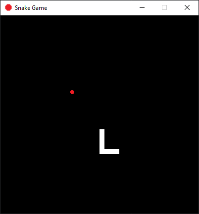

# Snake Game

Snake game with PyGame in Python.



## Usage
To run the game:
```
$ python main.py
```
Once you die, the restart button or the `r` key can be pressed to reset the game.

## More Links
- [https://pythonspot.com/snake-with-pygame/](https://pythonspot.com/snake-with-pygame/)
- [https://docs.replit.com/tutorials/19-build-snake-with-pygame](https://docs.replit.com/tutorials/19-build-snake-with-pygame)
- [https://pygame.readthedocs.io/en/latest/5_app/app.html](https://pygame.readthedocs.io/en/latest/5_app/app.html)
- [https://www.geeksforgeeks.org/snake-game-in-python-using-pygame-module/](https://www.geeksforgeeks.org/snake-game-in-python-using-pygame-module/)